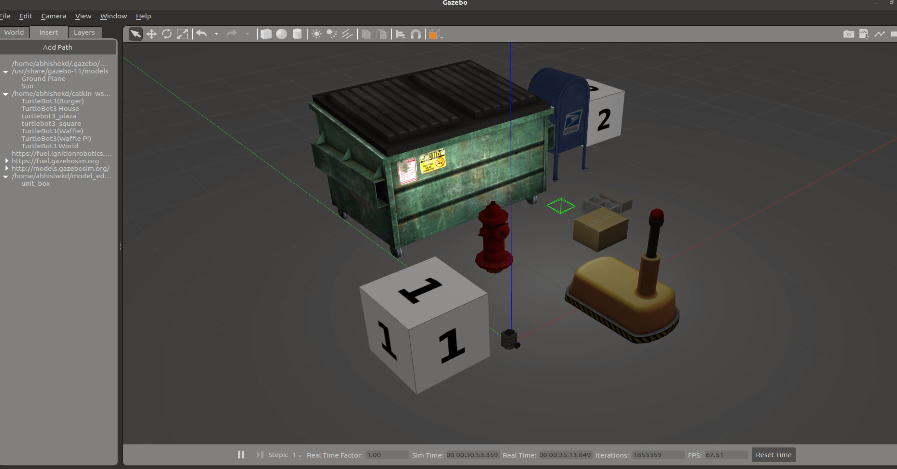

# Dynamic Path Planning of Multi-Agent Robotic Systems (MARSs)

This project aims to:
- Develop an **adaptive** and **robust** path planning solution for MARSs.
- Bridge the gap between theoretical algorithms and practical industry demands.

## By:
**Mohammad Ali**

### In collaboration with:
**Adityanshu Abhinav** [https://github.com/AadityanshuAbhinav]

### Under the Guidance of:
**Dr. Anuj Kumar Tiwari**

---

Key contributions of this project include:
- **Camera Calibration** for accurate depth perception and obstacle measurement.
- **Simulation using Gazebo** to evaluate Bug2-D* Lite before deployment.
- **Implementation on TurtleBot3**, demonstrating real-world effectiveness.

Potential applications include **search and rescue operations, warehouse logistics, and autonomous cleaning tasks**. Future enhancements involve handling extreme dynamism and integrating machine learning for **advanced object recognition**.

---

## 1. Introduction
### 1.1 Background and Motivation
Multi-Agent Robotic Systems (MARSs) are revolutionizing industrial automation by enhancing efficiency, productivity, and safety. However, a significant challenge in **dynamic path planning** arises in unpredictable environments, where obstacles move unexpectedly.

This project aims to:
- Develop an **adaptive** and **robust** path planning solution for MARSs.
- Bridge the gap between theoretical algorithms and practical industry demands.

### 1.2 Research Aims and Objectives
- Design and implement a **real-time path planning algorithm** incorporating **obstacle avoidance** and **dynamic replanning**.
- Evaluate its performance in a **simulated warehouse**.
- Analyze the algorithm's ability to optimize **path efficiency** for material transportation.

### 1.3 Resources & Requirements
#### Hardware:
- **TurtleBot3 Robot** with modular design and **ROS (Robot Operating System)** support.
- **LiDAR Sensor (LDS-01)** for real-time obstacle detection.
- **Intel RealSense Depth Camera D435i** for Aruco marker detection and robot localization.
- **Aruco Marker Tags** for precise robot positioning.

#### Software:
- **ROS Noetic** (Ubuntu 20.04 LTS) for robot control and algorithm implementation.
- **Gazebo Simulator** for testing before real-world deployment.
- **Custom ROS Packages** implementing Bug2-D* Lite with real-time sensor fusion.

---

## 2. Literature Review
- **Collision Avoidance Algorithms:** Utilize velocity obstacles for real-time navigation.
- **Multi-Robot Coordination:** Centralized vs. decentralized planning approaches.
- **Reactive Path Planning:** Adaptation using **Potential Field Methods** and **Bug algorithms**.

---

## 3. Experimental Setup
- **Aruco Marker-based Localization**: Camera calibration ensures accurate robot position estimation.
- **Camera Calibration**: Eliminates distortion and improves obstacle measurement accuracy.
- **ROS Node Implementation**: Publishes real-world coordinates for navigation.

---

## 4. Dynamic Path Planning
### 4.1 Path Planning Algorithms Studied:
1. **Dijkstra's Algorithm** - Static environment optimization.
2. **A star Algorithm** - Heuristic-based search for efficient pathfinding.
3. **D star Algorithm** - Dynamic adaptation with continuous path updates.
4. **D star Lite Algorithm** - Simplified real-time replanning.
5. **Bug2 Algorithm** - Reactive boundary-following approach.

### 4.2 Bug-D: Hybrid Approach
- **Combines Bug2's reactive avoidance with D star Lite’s real-time replanning**.
- **Prioritizes direct line-of-sight movement** while adapting to dynamic obstacles.
- **Leverages sensor fusion (LiDAR + Camera) for better environment perception**.

---

## 5. Simulation and Testing
### 5.1 Gazebo Simulation
- Implemented **Bug-D** on **TurtleBot3 in a warehouse environment**.
- Navigated from **Point P1 to Point P2** while avoiding **dynamic obstacles**.
- 

### 5.2 Performance Evaluation
- **Path Efficiency:** 1.1 (110% of the optimal path).
- **Adaptability:** Quick response to moving obstacles (~20 ms replanning time).
- **Real-time Performance:** Minimal delay (~10 ms between obstacle detection and replanning).
- **Computational Efficiency:** Low resource utilization for real-world feasibility.

---

## 6. Real-World Testing
### 6.1 Implementation on TurtleBot3
- Conducted tests in a **dynamic lab environment** with moving obstacles.
- **Sensor Fusion improved localization accuracy** (~0.2m error reduction in coordinates).
- **Performance mirrored simulation results** but revealed challenges in highly dynamic setups.

### 6.2 Observations & Learnings
- **Real-time replanning is effective** but can be improved for extreme cases.
- **Sensor noise impacts localization**, requiring **robust fusion techniques**.
- **Dense obstacle environments increase computation**, highlighting the need for further optimization.

---

## 7. Future Improvements
1. **Integrating Probabilistic Motion Planning (RRT)** to handle extreme obstacle movements.
2. **Enhancing Sensor Fusion** using **Kalman Filtering** or **Dynamic Bayesian Networks**.
3. **Applying Machine Learning** for real-time **object recognition and classification**.

---

## 8. Conclusion
This project successfully implemented **Bug-D with sensor fusion** for **dynamic path planning** in real-world environments. The findings demonstrate **robust adaptability** with potential applications in **industrial automation, search & rescue, and autonomous navigation**.

Further research will focus on **improving performance in highly dynamic environments** and **advancing AI-driven decision-making for real-time robotics**.

---

## 9. References
1. [Bug2 Algorithm - Automatic Addison](https://automaticaddison.com/the-bug2-algorithm-for-robot-motion-planning/)
2. [ROS-based Path Planning](https://www.researchgate.net/publication/325473185_ROS-based_Path_Planning_for_Turtlebot_Robot_using_RRT)
3. [Dynamic Planning - Carnegie Mellon University](https://www.cs.cmu.edu/~motionplanning/lecture/Chap2-Bug-Alg_howie.pdf)

---
